# 💻 API REST com CRUD para Alunos e Professores (Spring Boot + PostgreSQL)

Este projeto foi desenvolvido por **Anne Izabelle**, como parte da **Primeira/Segunda Avaliação da disciplina de Tecnologia para Back-End**.


A aplicação expõe uma API REST para gerenciamento acadêmico, contemplando:

- 👩‍🎓 **Alunos**
- 👨‍🏫 **Professores**
- 📚 **Disciplinas**
- 🧾 **Matrículas de Alunos em Disciplinas**

Foram implementados CRUDs completos para Aluno, Professor e Disciplina, além de regras de negócio para controle de Matrícula (status, notas e aprovação).

Utilizando **Java com Spring Boot**, **PostgreSQL**, **DBeaver** e testes no **Insomnia**.

---

## ⚙️ Tecnologias Utilizadas

- Java 17
- Spring Boot
- Maven
- PostgreSQL
- DBeaver
- Insomnia

---

## 🧩 Conceitos de POO e Arquitetura

O projeto segue o padrão clássico de camadas:

- `model` → Entidades JPA (`Aluno`, `Professor`, `Disciplina`, `MatriculaAluno`)
- `repository` → Interfaces que estendem `JpaRepository`
- `service` → Regras de negócio e orquestração
- `controller` → Endpoints REST

Recursos adicionais:

- **Enum**: `MatriculaStatusEnum` (`MATRICULADO`, `TRANCADO`, `APROVADO`, `REPROVADO`)
- **DTO**: `AtualizarNotasRequestDTO` para atualizar notas da matrícula

---

## 🧠 Endpoints — Alunos

Base: `/alunos`

| Método | Rota           | Descrição        |
|--------|----------------|------------------|
| POST   | `/alunos`      | Cadastrar aluno  |
| GET    | `/alunos`      | Listar todos     |
| GET    | `/alunos/{id}` | Buscar por ID    |
| PUT    | `/alunos/{id}` | Atualizar por ID |
| DELETE | `/alunos/{id}` | Deletar por ID   |

### 🧪 Testes no Insomnia — Aluno

#### ✅ Criar aluno — `POST /alunos`
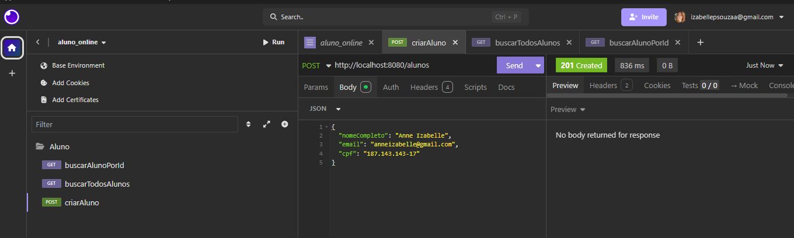

#### ✅ Listar alunos — `GET /alunos`
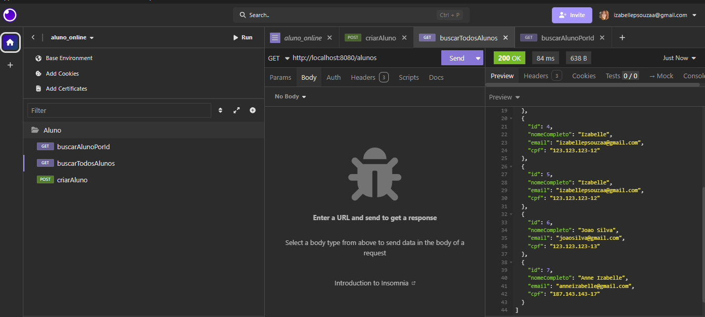

#### ✅ Buscar aluno por ID — `GET /alunos/{id}`
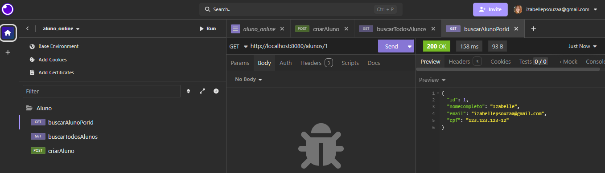

#### ✅ Atualizar aluno — `PUT /alunos/{id}`
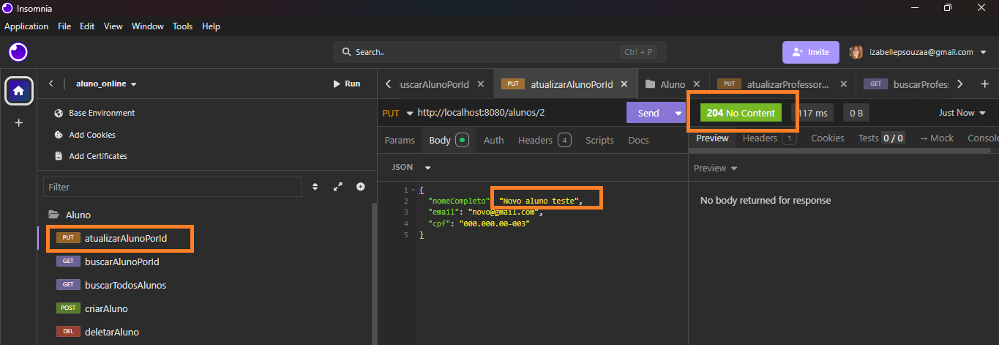

#### ✅ Deletar aluno — `DELETE /alunos/{id}`
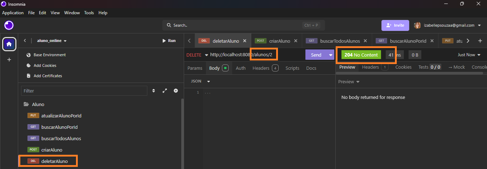

---

## 👨‍🏫 Endpoints — Professores

Base: `/professores`

| Método | Rota                  | Descrição           |
|--------|-----------------------|---------------------|
| POST   | `/professores`        | Cadastrar professor |
| GET    | `/professores`        | Listar todos        |
| GET    | `/professores/{id}`   | Buscar por ID       |
| PUT    | `/professores/{id}`   | Atualizar por ID    |
| DELETE | `/professores/{id}`   | Deletar por ID      |

### 🧪 Testes no Insomnia — Professor

#### ✅ Criar professor — `POST /professores`
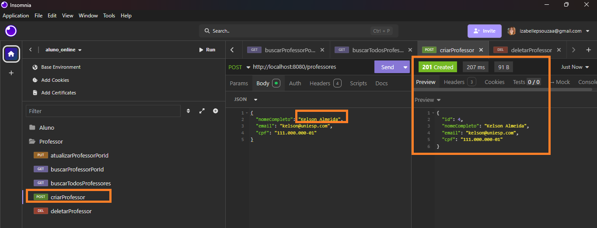

#### ✅ Listar professores — `GET /professores`
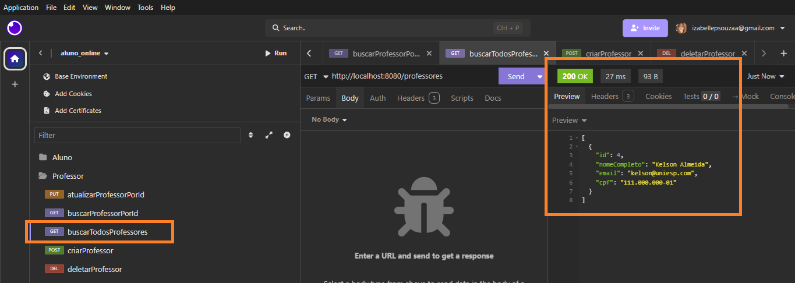

#### ✅ Buscar professor por ID — `GET /professores/{id}`
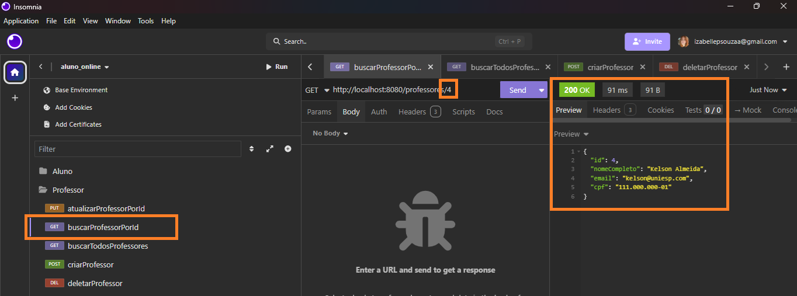

#### ✅ Atualizar professor — `PUT /professores/{id}`
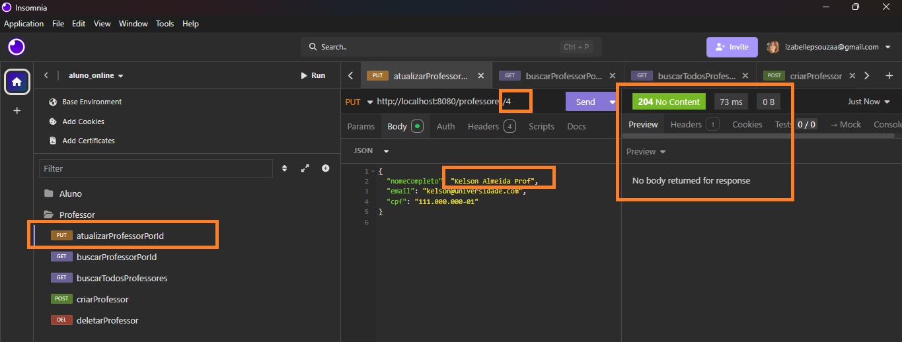

#### ✅ Deletar professor — `DELETE /professores/{id}`
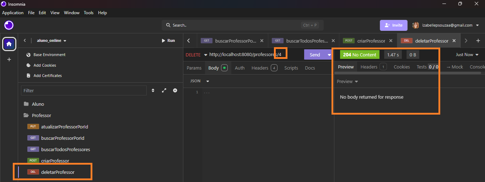

---

## 📚 Endpoints — Disciplinas

Base: `/disciplinas`

| Método | Rota                  | Descrição            |
|--------|-----------------------|----------------------|
| POST   | `/disciplinas`        | Cadastrar disciplina |
| GET    | `/disciplinas`        | Listar todas         |
| GET    | `/disciplinas/{id}`   | Buscar por ID        |
| PUT    | `/disciplinas/{id}`   | Atualizar por ID     |
| DELETE | `/disciplinas/{id}`   | Deletar por ID       |

### 🧪 Testes no Insomnia — Disciplina

> Ajuste os nomes dos arquivos abaixo conforme os prints que você salvou.

#### ✅ Criar disciplina — `POST /disciplinas`
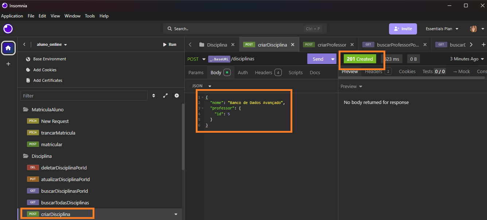

#### ✅ Listar disciplinas — `GET /disciplinas`
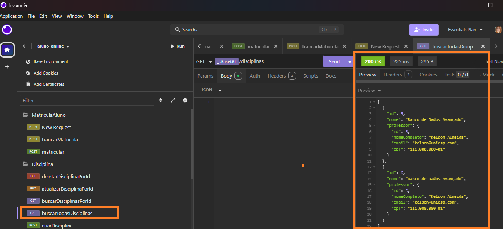

#### ✅ Buscar disciplina por ID — `GET /disciplinas/{id}`
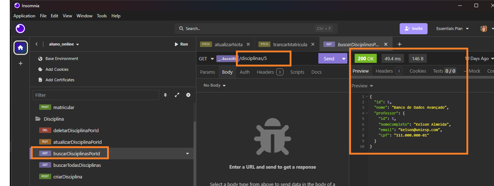

#### ✅ Atualizar disciplina — `PUT /disciplinas/{id}`
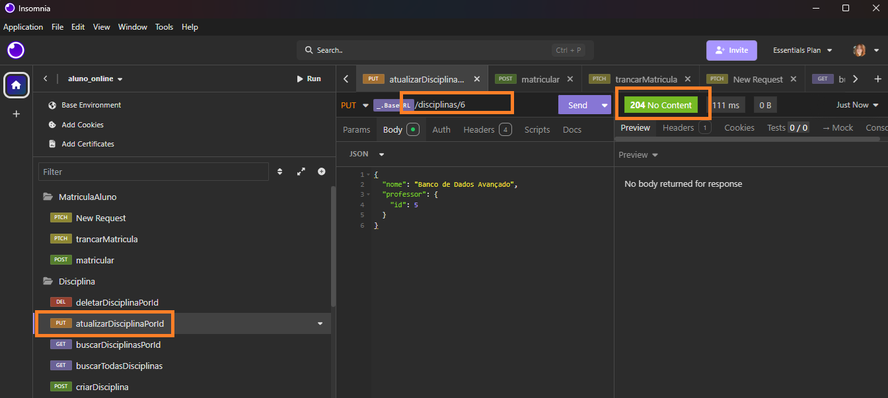

#### ✅ Deletar disciplina — `DELETE /disciplinas/{id}`
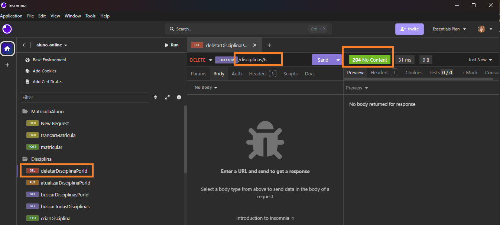

---

## 🧾 Endpoints — Matrícula de Aluno

Base: `/matriculas`

| Método | Rota                                | Descrição                                      |
|--------|-------------------------------------|-----------------------------------------------|
| POST   | `/matriculas`                      | Criar matrícula de um aluno em uma disciplina |
| PATCH  | `/matriculas/trancar/{id}`         | Trancar matrícula                             |
| PATCH  | `/matriculas/atualizar-notas/{id}` | Atualizar notas e recalcular status           |

### 🧪 Testes no Insomnia — Matrícula de Aluno

> Ajuste os nomes dos arquivos abaixo conforme os prints que você salvou.

#### ✅ Criar matrícula — `POST /matriculas`
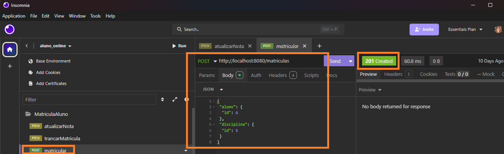

#### ✅ Trancar matrícula — `PATCH /matriculas/trancar/{id}`
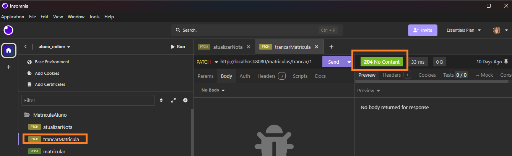

#### ✅ Atualizar notas — `PATCH /matriculas/atualizar-notas/{id}`
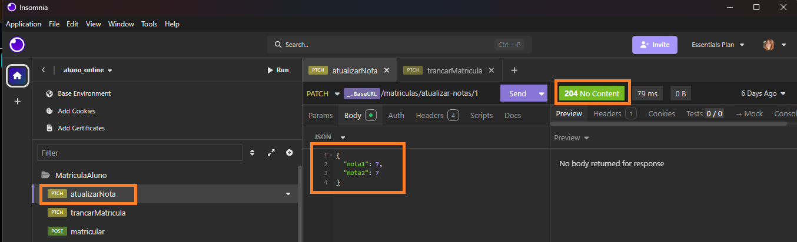

---

## 🧮 Regra de Negócio — Matrícula

A entidade `MatriculaAluno` representa o vínculo entre um aluno e uma disciplina, com controle de notas e status.

- Ao criar uma matrícula (`POST /matriculas`), o status inicial é `MATRICULADO`.
- O endpoint `PATCH /matriculas/trancar/{id}` altera o status para `TRANCADO`.
- O endpoint `PATCH /matriculas/atualizar-notas/{id}` recebe um DTO com `nota1` e `nota2`.

Regras:

- Calcula a média das duas notas.
- Se a média for **>= 7.0**, o status muda para `APROVADO`.
- Caso contrário, o status muda para `REPROVADO`.

Os status possíveis são definidos no enum `MatriculaStatusEnum`:

- `MATRICULADO`
- `TRANCADO`
- `APROVADO`
- `REPROVADO`

---

## 🗄 Banco de Dados (PostgreSQL)

Banco gerenciado com **DBeaver**.

### 📌 TABELA `aluno`

| Campo          | Tipo             | Descrição   |
|----------------|------------------|-------------|
| `id`           | serial / bigint  | ID do aluno |
| `nomeCompleto` | varchar(255)     | Nome        |
| `email`        | varchar(255)     | E-mail      |
| `cpf`          | varchar(255)     | CPF         |

### 📌 TABELA `professor`

| Campo          | Tipo             | Descrição        |
|----------------|------------------|------------------|
| `id`           | serial / bigint  | ID do professor  |
| `nome_completo`| varchar(255)     | Nome             |
| `email`        | varchar(255)     | E-mail           |
| `cpf`          | varchar(255)     | CPF              |

### 📌 TABELA `disciplina`

| Campo          | Tipo             | Descrição                              |
|----------------|------------------|----------------------------------------|
| `id`           | serial / bigint  | ID da disciplina                       |
| `nome`         | varchar(255)     | Nome da disciplina                     |
| `professor_id` | bigint           | Professor responsável (`professor.id`) |

### 📌 TABELA `matricula_aluno`

| Campo          | Tipo             | Descrição                                         |
|----------------|------------------|---------------------------------------------------|
| `id`           | serial / bigint  | ID da matrícula                                  |
| `aluno_id`     | bigint           | Aluno matriculado (`aluno.id`)                   |
| `disciplina_id`| bigint           | Disciplina (`disciplina.id`)                     |
| `nota1`        | numeric          | Primeira nota                                     |
| `nota2`        | numeric          | Segunda nota                                      |
| `status`       | varchar          | Status da matrícula (enum `MatriculaStatusEnum`) |

### 🖼 Prints — DBeaver


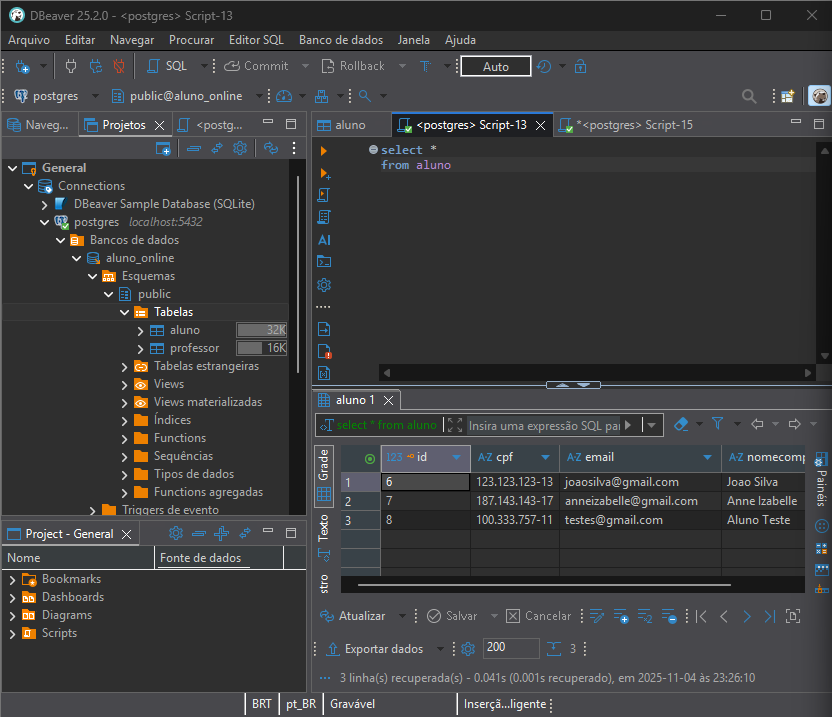  
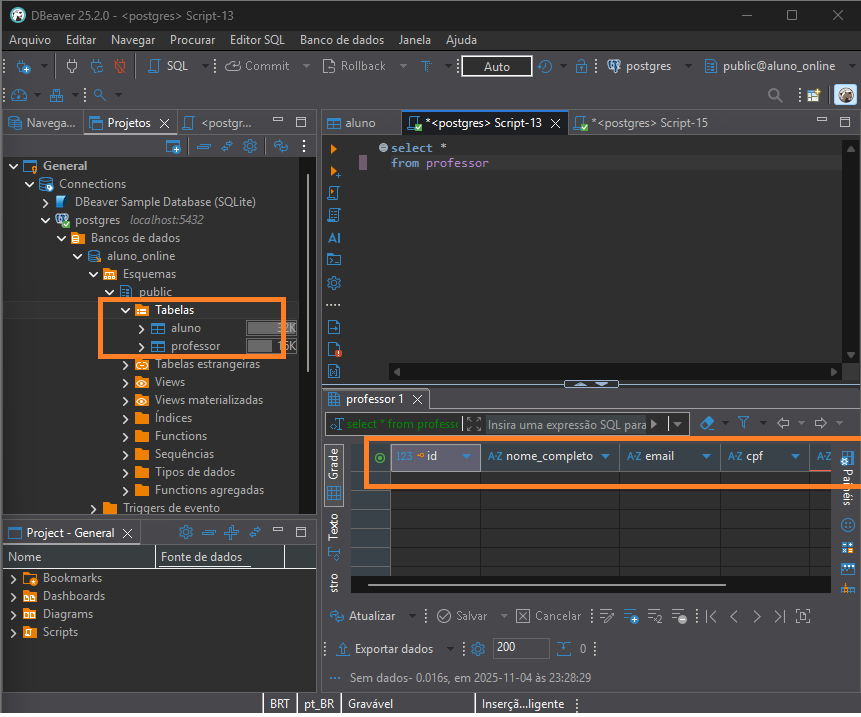  
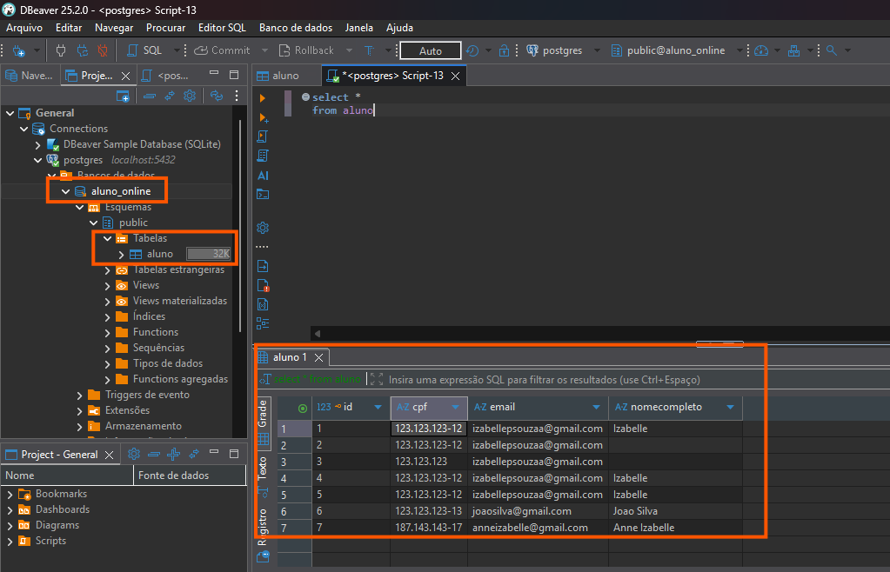  
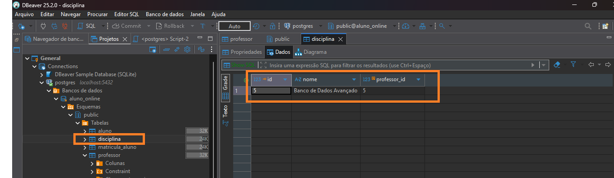  
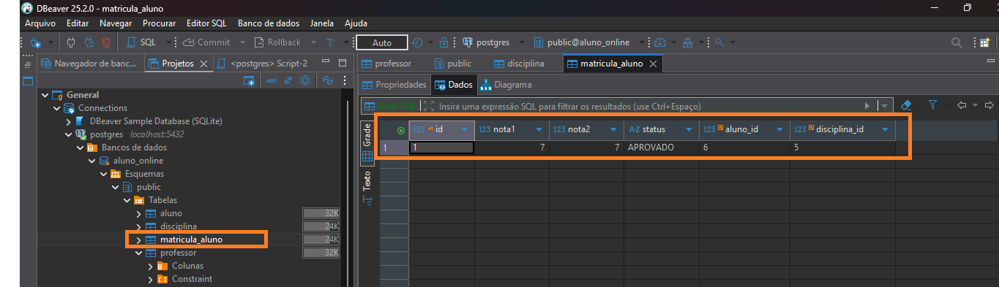

---

## 📁 Estrutura do Projeto

```text
api
 └── src
     ├── main
     │   ├── java
     │   │   └── br/com/alunoonline/api
     │   │       ├── controller      # Controllers REST
     │   │       ├── model           # Entidades JPA
     │   │       ├── repository      # Interfaces JpaRepository
     │   │       ├── service         # Regras de negócio
     │   │       ├── dtos            # DTOs (AtualizarNotasRequestDTO)
     │   │       └── enums           # MatriculaStatusEnum
     │   └── resources               # application.properties
     └── imagens                     # Prints do Insomnia e DBeaver
```

---

## 🚀 Como Executar o Projeto

### 1. Clonar o repositório

```bash
git clone https://github.com/izabellesouza/aluno-online-anneizabelle.git
cd aluno-online-anneizabelle/BackEnd/api
```

### 2. Configurar o banco de dados

Criar um banco PostgreSQL chamado `aluno_online`.

Editar o arquivo `src/main/resources/application.properties`:

```properties
spring.application.name=Aluno Online
spring.datasource.url=jdbc:postgresql://localhost:5432/aluno_online
spring.datasource.username=SEU_USUARIO
spring.datasource.password=SUA_SENHA

spring.datasource.driver-class-name=org.postgresql.Driver
spring.jpa.show-sql=true

spring.datasource.testWhileIdle=true 
spring.datasource.validationQuery=SELECT 1

spring.jpa.hibernate.ddl-auto=update

spring.jpa.hibernate.naming.implicit-strategy=org.hibernate.boot.model.naming.ImplicitNamingStrategyLegacyHbmImpl
spring.jpa.hibernate.naming.physical-strategy=org.hibernate.boot.model.naming.PhysicalNamingStrategyStandardImpl
spring.jpa.properties.hibernate.dialect=org.hibernate.dialect.PostgreSQLDialect
```

> Por segurança, usuário e senha **não** ficam versionados. Use os dados locais da sua máquina.

### 3. Rodar a aplicação

```bash
mvn spring-boot:run
```

Ou executar a classe principal no **IntelliJ IDEA**.

### 4. Testar no Insomnia

Usar as rotas descritas acima para testar:

- CRUD de **Alunos**
- CRUD de **Professores**
- CRUD de **Disciplinas**
- Controle de **Matrícula** (criar, trancar, atualizar notas)

---

## 📌 Observações

- CRUD completo de Aluno, Professor e Disciplina
- Regras de negócio implementadas para Matrícula de Aluno
- Banco criado e populado no PostgreSQL
- Testes realizados no Insomnia
- Projeto organizado em camadas (controller, service, repository, model, dto, enum)

---

🧡 Desenvolvido por **Anne Izabelle**  
📚 Disciplina: *Tecnologia para Back-End*  
👨‍🏫 Professor: *Kelson Almeida*
